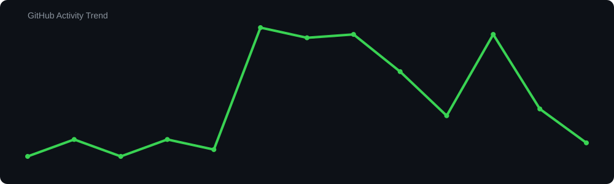

<h1 align="left">Hey, I'm Naman 👋</h1>

**Full-stack engineer with an eye for design.** I build products end to end — from the database and APIs to pixel-perfect, animated interfaces that people actually enjoy using.

I sketch ideas on Excalidraw, build them in code, and ship them. A lot of my work starts as "I saw this on X, can I make it better?" — and sometimes ends with ML models, Go services, or Chrome extensions behind the UI.

  
  
  
  

## GitHub Activity

### Contribution Trend

### Featured work

| Project | What it is | Built with |
|---|---|---|
| [**MotionKit**](https://github.com/NamanSharma2112/MotionKit) · [live](https://www.motionlib.me) | Production-ready animated React components — copy, paste, ship | React · TypeScript · Motion |
| [**ChurnRate**](https://github.com/NamanSharma2112/churnrate) · [live](https://www.churnrate.fun) | Upload customer data, get ML-powered churn predictions per customer | Next.js · TypeScript · ML |
| [**OpsPulse**](https://github.com/NamanSharma2112/OpsPulse) | Delivery & reliability signals for GitHub repos from webhook events | Go |
| [**CrudeIQ**](https://github.com/NamanSharma2112/CrudeOilPrediction) | Oil-market intelligence dashboard with ML price forecasting | TypeScript · ML |
| [**Flyby**](https://github.com/NamanSharma2112/Flyby) | Chrome extension — a tiny plane flies a banner across your screen before your next meeting | JS · Manifest V3 · Google Calendar |
| [**Lead Management Platform**](https://github.com/NamanSharma2112/LeadMangementSystem) · [live](https://lead-mangement-system-one.vercel.app) | Decoupled full-stack monorepo for capturing and managing leads | Node · Express · TypeScript |
| [**AI Coding Agent**](https://github.com/NamanSharma2112/ConversAIlabs) | Autonomous agent that explores a codebase and implements requirements | Python · LLMs |
| [**Virgil launch video**](https://github.com/NamanSharma2112/heavenclip) | Frame-accurate recreation of a SaaS launch video in code | Remotion · React |

<i>Open to full-stack / frontend roles and freelance builds — say hi on <a href="https://x.com/NamanSharma2112">X</a> or <a href="https://www.linkedin.com/in/namansharma--ns/">LinkedIn</a>.</i>

